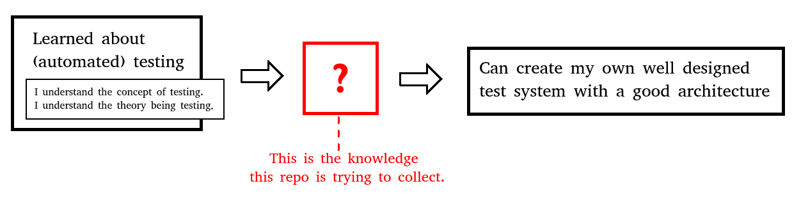

Automated Software Testing - Advanced Topics
==============================================

#### **What is this? / Purpose of this repo**
This page / repo ought to be a collection of practical advanced topics about automated testing - Something like follow-up guide on auto testing after one is familiar with the basic concepts (Like if you read a programming book and now need to learn about software architecture) (See also [this question on Stackexchange](https://sqa.stackexchange.com/questions/49876/exhaustive-resources-on-concrete-advanced-test-automation-practices).

#### Background
I'm searching for a couple of years now, but could not find much consolidated useful information for the bridge between *I understand the concept of auto testing* and *I can confidently write a well designed test system*. This collection should help me (and hopefully others) to get on that way.

#### Copyright Infringement Notice
I don't mean to infringe anyones copyright with the *offline versions*. They are there to prevent dead links for the future. If you feel infringed, please contact me or leave a bug report.

# Open questions

For the following questions, I couldn't yet find a topic.

- How do you express the "functional dependency order" of tests?  
I.e. `test2` makes use of functionality `test1` tests exhaustively. How do I express that in a test? Background: I'd If test1 and test2 both fail, it should be clear, that test1 is the one I should look for an error first.

- How do I express priorities for tests?  
E.g. there is `test_show_error_message` and `test_software_starts_up`. `test_software_starts_up` is the the test with more priority and if anything happens should be looked at first. How do I express that?

- How do I express that tests take only short time or a long time to test?

- How do I express that tests have external dependencies?

- Unit tests, Integration Tests, System Tests, ... Do I have a completely separated test system for each of these? If yes, How do I make sure to not forget to start up each of them after a change?

- How should I implement the same test with many different inputs?  
E.g. I want to test an `add(a,b)` function: do I have many different tests with rather silly names like `test_test_lower_bound` and make it difficult to overview or do I use some kind of CSV table to feed in data? Pros? Cons?

- How do I handle database test?  
 Do I build up and destroy a database server everytime a test starts that needs the database? Do I use one huge test database containing all test data for all tests and use transactions and rollbacks? What I test code that finishes transaction? What I I'm working with a MySQL database?

- How do I maintain all of the tests?

# Collection of topics

## Testing types

- Testing static values (most basic form: assert_equal (foo(5), output=25)
- Fuzz Testing: Basically brute force testing [offline](local_resources/Test_Type_Fuzz_Testing.html) | [online](https://www.tutorialspoint.com/fuzz-testing-fuzzing-tutorial-what-is-types-tools-example)

## Testing Areas / Testiong circumstances
- Load testing: *How does the app work under (heavy) work load?* [online](https://www.tutorialspoint.com/load-testing-tutorial-definition-how-to-example) 

- Backend testing: [online](https://www.tutorialspoint.com/backend-testing-tutorial-what-is-tools-examples)

## Misc
The following list links to various topics.

- Robert Nystrom - Game Programming Patterns: How a test suite should look (don't remember concrete chapters) [online](http://gameprogrammingpatterns.com/)
- Justin Searls - How to stop hating your test suite [youtube](https://www.youtube.com/watch?v=VD51AkG8EZw)

- About What kind of tests to write/ to not write: [offline](local_resources/What_kind_of_tests_to_write.MD) | [online](https://sqa.stackexchange.com/a/45609/52466)

- More scientific approach on *what tests to automate* [youtube](https://www.youtube.com/watch?v=VL-_pnICmGY)

- Where to start in a system without any tests ([SE question](https://sqa.stackexchange.com/q/45603/52466))
  - "If you have no tests, start with End-to-End tests, then move them slowly down to lower levels" [offline](local_resources/overlapping_tests_end-to-end_API.md) | [online](https://sqa.stackexchange.com/a/45610/52466)
  -
- About overlapping tests:
  - [offline](local_resources/overlapping_tests.md) | [online](https://sqa.stackexchange.com/a/45608/52466)

- About end-to-end testing: [offline](local_resources/End-to-End_Testing_Tutorial.html) | [online](https://www.tutorialspoint.com/end-to-end-testing-tutorial-what-is-e2e-testing-with-example)

- Martin Fowler - Testing asynchronous Javascript [online](https://martinfowler.com/articles/asyncJS.html)
- Martin Fowler - In Memory Test Database [online](https://martinfowler.com/bliki/InMemoryTestDatabase.html)
- Martin Fowler - GUI Tests: The Page Object [online](https://martinfowler.com/bliki/PageObject.html)
- Martin Fowler - Self Testing Code [online](https://martinfowler.com/bliki/SelfTestingCode.html)

## More abstract topics
- Unit testing anti-patterns catalog [online](https://stackoverflow.com/questions/333682/unit-testing-anti-patterns-catalogue?answertab=votes#tab-top)
  - Second Class Citizen (= no good architecture for test code)
  - The Free Ride (= add test cases to existing tests)
  - Happy Path (= Don't test critical behavior)
  - Local Hero (= Test depends on something specific of the development environment)
  - Hidden Dependency (= Test depends on something undocumented)
  - Chain Gang (= Tests that must run in a certain order)
  - The Mockery (= Too many mocks; Test mock object instead of domain code)
  - The Silent Catcher (= Test if *an* exception is thrown; but the thrown exception was an unexpected one)
  - The Inspector (= A unit test that violates encapsulation in an effort to achieve 100% code coverage)
  - Excessive Setup (= Test that requires a huge setup)
  - Anal Probe (= A test which has to use insane, illegal or otherwise unhealthy ways to perform its task)
  - [The Test With No Name](https://stackoverflow.com/a/336766/6702598) (= E.g. `testForBUG123`)
  - Butterfly (= Test with data that changes all the time (like current date/time)
  - Flickering Test (= Test which occasionally fails, not at specific times; is generally due to race conditions within the test)
  - Wait and See (= Setup, `sleep` a specific amount of time, check)
  - Inappropriately Shared Fixture (= Several test cases in the test fixture do not even use or need the setup / teardown)
  - The Giant (= Test that, although it is validly testing the object under test, can span thousands of lines and contain many many test cases)
  - [I'll believe it when I see some flashing GUIs](https://stackoverflow.com/a/339807/6702598) (= fixation/obsession with testing the app via its GUI 'just like a real user')
  - Wet Floor (= Don't clean up persisted data after test)
  - Cuckoo (= A unit test which sits in a test case with several others, and enjoys the same (potentially lengthy) setup process as the other tests in the test case, but then discards some or all of the artifacts from the setup and creates its own.)
  - [The Secret Catcher ](https://stackoverflow.com/a/334026/6702598) (= Test that  appears to be doing no testing, due to absence of assertions. The test is really relying on an exception to be thrown and expecting the testing framework to capture the exception and report it to the user as a failure)
  - The Conjoined Twins (= *Integration test* that are called *Unit tests*)

- Martin Fowler on `testing` [online](https://martinfowler.com/tags/testing.html)
  - Specification By Example [online](https://martinfowler.com/bliki/SpecificationByExample.html)
  - Testing Strategies in a Microservice Architecture [online](https://martinfowler.com/articles/microservice-testing)
  - The Practical Test Pyramid [online](https://martinfowler.com/articles/practical-test-pyramid.html)
  - Is TDD dead [online](https://martinfowler.com/articles/is-tdd-dead/)
  - Eradicating Non-Determinism in Tests [online](https://martinfowler.com/articles/nonDeterminism.html)
  - Mocks Aren't Stubs [online](https://martinfowler.com/articles/mocksArentStubs.html)
  - Continuous Delivery [online](http://yow.eventer.com/events/1004/talks/1062)
  - QA in Production [online](https://martinfowler.com/articles/qa-in-production.html)
  - Test Impact analysis [online](https://martinfowler.com/articles/rise-test-impact-analysis.html)
  - Database And Build Time [online](https://martinfowler.com/bliki/DatabaseAndBuildTime.html)
  - Software that isn't testable [online](https://martinfowler.com/bliki/Detestable.html)
  - Exploratory Testing [online](https://martinfowler.com/bliki/ExploratoryTesting.html)
  - Humble Objects [online](https://martinfowler.com/bliki/HumbleObject.html)
  - Self Initializing Fake [online](https://martinfowler.com/bliki/SelfInitializingFake.html)
  - Testing strategy: Synthetic Monitoring [online](https://martinfowler.com/bliki/SyntheticMonitoring.html)
- Martin Fowler on `Test Categories` [online](https://martinfowler.com/tags/test%20categories.html)
  - [On the Diverse And Fantastical Shapes of Testing](https://martinfowler.com/articles/2021-test-shapes.html)
  - [Unit Test](https://martinfowler.com/bliki/UnitTest.html)
  - [User Journey Test](https://martinfowler.com/bliki/UserJourneyTest.html)
  - [Story Test](https://martinfowler.com/bliki/StoryTest.html)

