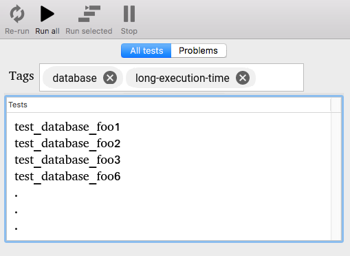

# Structuring / Managing tests by using tags

This article describes *the concept* of declaring tags/properties for tests that can be filtered by.


## The Problem
**Source code can only be structured hierarchically.**

A test might be in a test class within a test namespace within a test package. A source file is stored in a folder within a folder within a folder. A source file is basically one-dimensional (y-axis, from top to bottom).

The problem is a test (or function or file, for that sake) can have more properties to be structured / sorted by:

- Which feature is under test
  - (I think this one is used for most unit tests)
- Test *level* / *priority*
  - Is this feature basic functionality of the app that absolutely has to work and has first priority for fixing?
  - Or is it some extended feature that has lower priority in fixing speed?
- Test importance
  - Within a given feature, does the test test esoteric behavior or a common case used by 10 million users?
- Test execution time
- Unit test / Integration Test / System Test?
- Involves a database?
- Needs an external dependency and could therefore fail
  - Yes, *you should never have them*, well guess what: They are there in the wild if you like it or not. Sometimes you can't easily get rid of them. Ignoring them won't help.
- Security relevance


I mean... after all even bug reports can have priorities and other tags. What makes tests so special to not share the same features?


## The Idea

**1. Allow tests to define tags (/properties).**
**2. Make test suites able to use / filter those tags**

One simple example might be the following:

```
def test_add():
  """
  @tags: basic
  """
  self.assert_equal (add(0,0), 0)
```

or

```
def test_database_test_timeout():
  """
  @tags: database, long-execution-time, security-level-0
  """

  ' ...
```


## How tags are used

This chapter presents one example usage for tags. Don't be confused: There are more ways to utilize them.




## Prototype

TODO - feel free to create one.